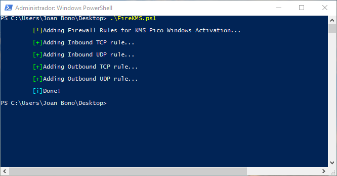
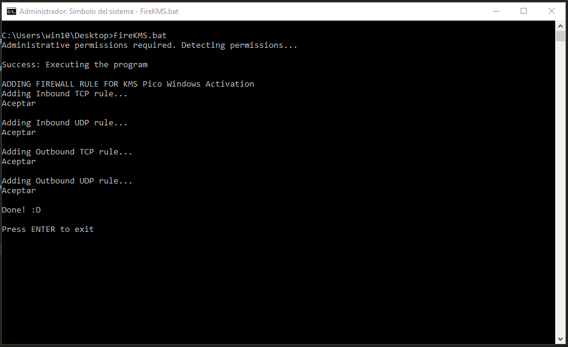

# FireKMS
Firewall rules for successfully execute KMS Windows activator (Educational purposes)

This program allows you to activate your Windows using [KMSPico](https://www.quora.com/What-is-KMSpico-and-can-it-activate-Windows-10-from-a-KMSpico-activated-Windows-8-1) for educational purposes only, as debugging or retrieving information.

***

## USAGE

### Powershell

+ Open a `powershell` with Administrator Privileges.
~~~~
PS C:\Users\win10\Desktop> .\FireKMS.bat
~~~~

+ Output.

### CMD

+ Open a `cmd` with Administrator Privileges.
~~~~
C:\Users\win10\Desktop> FireKMS.bat
~~~~

+ Output.

***

### This program is for educational purposes only.
